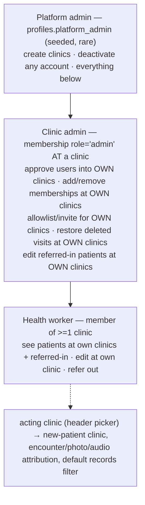
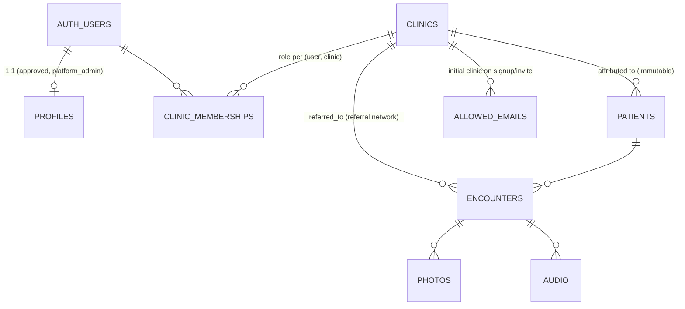
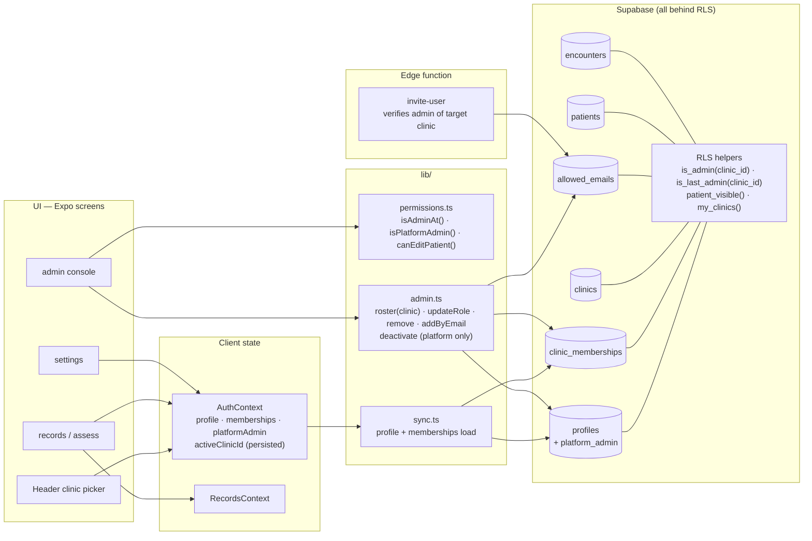

# User / Clinic Management — Redesign Plan

Status: **agreed design, not yet implemented.** Decisions locked with owner on 2026-08-15.
Static UI mocks: [`docs/mocks/app-shell.html`](mocks/app-shell.html) · [`docs/mocks/admin-console.html`](mocks/admin-console.html) · [`docs/mocks/system-design.html`](mocks/system-design.html)

## 1. Problem

The database is already a clean many-to-many model (`clinic_memberships`, `unique(user_id, clinic_id)`), but every layer above it assumes **one clinic per user** and **memberships are append-only**:

- `memberships[0]` is hard-wired as "the user's clinic" in 4 places — `state/AssessmentContext.tsx:128` (every new encounter), `components/PhotoCard.tsx:49`, `components/AudioCard.tsx:68`, `app/(tabs)/settings.tsx:58-62`.
- Admin console can only *add* a membership (approve/invite) or *globally deactivate* an account. No reassignment, no second clinic, no role change, no removal.
- Approving a pending user into a different clinic silently **adds** a membership and never removes the old one (`lib/admin.ts:167-173`).
- `is_admin()` means "admin at ANY clinic" → global platform powers (see every clinic's patients, manage the whole allowlist, create clinics). Server RLS and `lib/permissions.ts` both implement this.
- No DELETE policy on `clinic_memberships` — memberships can never be removed through the API.

## 2. Decisions (locked)

| Question | Decision |
|---|---|
| Admin powers scoped? | **Per-clinic admin** + a rare `platform_admin` tier for cross-clinic actions |
| Multi-clinic users? | **Yes, full** — membership CRUD + acting-clinic picker |
| Acting-clinic picker location | **Header**, visible whenever `memberships.length > 1` |

## 3. Target model

Two orthogonal axes:

- **Account state** (global, on `profiles`): `pending → active ⇄ deactivated`.
- **Memberships** (per clinic): `assigned / role / removed`. Record attribution (`patients.clinic_id`, `encounters.clinic_id`, `photos.clinic_id`, `audio.clinic_id`) is **historical fact** — never rewritten when a membership changes.

Permission tiers:

Relationships:

## 4. UI / UX changes

Mocks: [`app-shell.html`](mocks/app-shell.html) (patient-facing surfaces) · [`admin-console.html`](mocks/admin-console.html) (admin console, clinic-admin vs platform-admin views). Summary:

1. **Header clinic picker** (new component). Only renders when the user has >1 membership. Selection = `activeClinicId` (persisted client-side; defaults to first membership). Drives exactly one attribution decision — the clinic of a **new visit** (patient + encounter) — and the records **scope**: the app is strictly clinic-at-a-time (acting clinic's patients ∪ referrals into it; no "all my clinics" aggregate view — switching is the only way to see another clinic's desk). This is a query-scoping rule, not a security boundary: RLS stays membership-based; every patient query filters to the acting clinic (one deliberate exception: records search, §4.5), and that filter composes with `patient_visible()`.
2. **Photo/audio carry no clinic UI at all.** Media inherit `encounters.clinic_id` (the encounter is the attribution anchor). Today the client stamps `photos.clinic_id` / `audio.clinic_id` with an independently-chosen `memberships[0]` (`PhotoCard.tsx:99`, `AudioCard.tsx:128`) which can diverge from the encounter's clinic; the redesign removes the choice instead of surfacing it.
3. **Settings** — "My Memberships" card: every clinic + role, acting-clinic default. Platform-admin badge when applicable. Replaces the `memberships[0]` display.
4. **Admin console → clinic-scoped** (mirrors the records screen). The console always manages the **acting clinic** — the same header chooser, no separate dropdown, no cross-clinic flat lists. Switch clinics → every card re-scopes:
   - **Roster** — one row per member *of this clinic*: inline **role select** (reassign role at this clinic) + **remove (×)**; last-admin guard disables remove/demote with an explanation; other-clinic memberships show read-only as context, managed from that clinic's view;
   - **Add member by email** — existing approved user gains a membership at this clinic; unknown email falls through to the invite flow. Clinic admins never enumerate other clinics' rosters (no foreign-roster browsing; covers transfers and second-clinic assignments);
   - **Pending approvals** — global list (pending users belong to no clinic yet); action is local: *Approve into \<acting clinic\>* with chosen role;
   - **Invite** — into the acting clinic;
   - **Deactivate** (global account action) — platform admins only, in the expanded person row;
   - **Clinics card** (create clinic) — platform admins only.
5. **Global patient search — records screen only, always all-clinics.** The list stays clinic-at-a-time; the search box **always** spans all your clinics + referrals — there is deliberately **no per-clinic search mode** (one clinic control: the header picker; the records screen's existing clinic-filter dropdown is removed). RLS-bounded: the query simply omits the acting-clinic filter — `patient_visible()` already defines entitlement, so search exposes nothing new. Results are a **directory**, not a reader: name, MRN, clinic chip ("here" vs "switch ›"). Opening a result at another clinic confirm-switches `activeClinicId` first. Assess and the admin console never search cross-clinic. If result noise ever matters with many memberships, a refine-on-results chip is the later escape hatch.

## 5. System design

## 6. Server changes (`supabase/schema.sql`)

1. `profiles.platform_admin boolean not null default false`; seed existing admins in the same migration.
2. `is_admin(clinic_id uuid)` replaces global `is_admin()`; new `is_last_admin(clinic_id)`.
3. Policy rework:

| Table | New rule |
|---|---|
| `clinic_memberships` insert / update / **delete (new)** | `is_admin(clinic_id)`; delete & admin→health_worker demotion blocked by last-admin guard; own admin membership not editable; `clinic_id` immutable on update (delete + insert instead) |
| `allowed_emails` | manage rows where `is_admin(clinic_id)` — admins only see their own clinics' invites |
| `clinics` insert | `platform_admin` only |
| `profiles` select | self ∨ `platform_admin` ∨ shares ≥1 clinic (replaces global `is_admin()`) |
| `profiles` update `approved=true` | any clinic admin (membership insert RLS still limits to own clinics) |
| `profiles` update `approved=false` | `platform_admin` only (cross-clinic action) |
| `patients` / `encounters` select | drop global-admin clause — `patient_visible()` already correct (own clinic + referred-in) |
| `patients` / `encounters` update | member of the record's own clinic ∨ admin of a clinic it was **referred into** (receiving-clinic admin) ∨ `platform_admin`. Workers: referred-in stays read-only. |
| `photos` / `audio` insert | `clinic_id` becomes **derived**: `before insert` trigger sets `new.clinic_id = (select clinic_id from encounters where id = new.encounter_id)`; client-supplied value only honored when `encounter_id` is null (schema permits orphans). RLS unchanged (`clinic_id in my_clinics()`) — evaluates the derived value. Existing rows: no backfill needed, `encounter_id` is always set in practice. |

4. Edge function `invite-user`: JWT check becomes *admin of the chosen clinic*.

## 7. Client changes

- `lib/permissions.ts`: `isAdminAt(user, clinicId)`, `isPlatformAdmin(user)`, `isAdminAnywhere` (gates the Admin tab); `canEditPatient` = own clinic ∨ admin of patient's clinic ∨ platform admin. Update `tests/lib/permissions.test.ts`.
- `AuthContext`: load `platform_admin`; add persisted `activeClinicId`; expose clinic-picker state.
- `memberships[0]` call sites: `AssessmentContext` (new-visit clinic) and `settings` switch to `activeClinicId`; `PhotoCard` / `AudioCard` **stop sending `clinicId` entirely** (server derives it from the encounter) — same for the insert payloads in `lib/photos.ts` / `lib/audio.ts`.
- `lib/admin.ts`: `loadRosterCloud(clinicId)` (memberships ⋈ profiles for one clinic — replaces the load-everything client-side join), `updateMembershipRoleCloud`, `removeMembershipCloud`, `addMemberByEmailCloud` (existing user → membership at acting clinic; unknown email → invite flow); deactivate stays platform-gated.
- `app/(tabs)/records.tsx`: remove the clinic-filter `SelectField` (the header picker is the only clinic control); search box spans all memberships per §4.5.

## 8. Migration order (each phase ships independently)

1. **Schema migration** — columns, policies, guards, `platform_admin` seeding. Safe to deploy first: today's global admins keep identical powers as platform admins.
2. **`permissions.ts` + tests.**
3. **`activeClinicId` + header picker; replace the 2 remaining `memberships[0]` call sites; drop client-supplied media `clinic_id` (with the insert trigger from phase 1).**
4. **Membership CRUD (`lib/admin.ts`) + admin console rebuild.**
5. **`invite-user` edge-function scoping.**

## 9. Edge cases

- **Self-lockout** — last-admin guard is per-clinic; platform admin can always re-admin.
- **Existing admins** — must be seeded `platform_admin` when policies flip, or they lose global powers.
- **Referred-in edit rights change** — today *any* admin edits *any* patient. After: receiving-clinic **workers** stay read-only on referred-in patients (as today); receiving-clinic **admins** gain edit rights scoped to referrals into their clinic; everyone else loses cross-clinic edit. Communicate before rollout.
- **Membership removal ≠ clinical deletion** — DELETE hits the access row only. Clinical tables keep their no-DELETE-policy invariant; records are clinic-owned (`clinic_id` + `created_by` immutable), so a removed member's data stays fully visible to the clinic and re-adding restores the user's view. If membership history is ever needed for audit: append-only history table fed by a `before delete` trigger (zero live-query cost) — deferred until there's a real requirement.
- **Records attribution is immutable** — removing a membership never rewrites history; user just loses visibility.

## 10. Testing

**Visibility rules under test** (the matrix every layer asserts):

| Persona | Sees | Edits |
|---|---|---|
| Worker (clinics A+B) | patients at A ∪ B ∪ referred-into A/B *(RLS truth — but the app only ever shows one clinic's slice at a time)* | patients *of* A/B (incl. referred-out — full history); referred-in read-only |
| Clinic admin of A | same shape as a worker at A | + patients referred **into** A; restore deleted visits at A |
| Platform admin | everything | everything |

1. **Unit** (extend `tests/lib/permissions.test.ts`) — `isAdminAt`, `isPlatformAdmin`, multi-membership `canSeePatient`, referred-in read-only, `activeClinicId` defaulting. Pure functions, CI-fast.

   The matrix is the **RLS truth**; the app is clinic-at-a-time on top of it (§4.1) with one deliberate exception: records search spans all memberships (§4.5). Unit tests cover both: list queries are clinic-filtered (`clinic_id = activeClinicId ∨ referred-into it`); search queries omit the filter (RLS-bounded) and results carry the clinic chip; opening a foreign-clinic result confirm-switches `activeClinicId`.
2. **RLS integration** (new, the layer that matters) — `supabase start` (local Docker stack) → `schema.sql` + `seed.sql` → jest suite (`tests/integration/`) that signs up real personas through local auth (workerA, workerAB, adminA, adminB, platform, pending) and queries via supabase-js as each persona. Assert denials by error code (`42501`) using `single()` / `count: 'exact'` so RLS rejection is loud, not a silent empty array.
3. **Migration** — run the new DDL twice (idempotency) and against a dump of current prod shape (existing global admins must land as `platform_admin`).
4. **Manual QA on Expo web** — picker switching, attribution strip, roster ops, last-admin guard UX, add-by-email flow, cross-clinic search → switch-and-open.

**The keystone test — membership-revocation round-trip:** workerAB at A+B asserts visibility of both clinics' patients + referrals into both across every table (patients, encounters, photos, audio); remove the B membership as admin; assert B's slice and B-referrals vanish while A is untouched; re-add; assert restored. One scenario exercises `my_clinics()`, `patient_visible()`, the delete policy, and every select policy. Safety-critical sibling: **last-admin guard** — sole-admin delete/demote rejected (`42501`); second admin added → succeeds.

## 11. Hard-won RLS design rules (verified by probe + pinned by tests)

Three Postgres behaviors shaped the final policy set — all discovered the hard way against the real stack:

1. **SELECT policies gate the NEW row on writes.** For UPDATE and for `INSERT … RETURNING` (supabase-js `.upsert().select()`), the row's SELECT policy is applied to the new/candidate row. You cannot write a row into a state you couldn't see — this produced the approve-path 42501 (fixed by membership-before-approve ordering) and the save-path 42501 (every patient/encounter save) below.
2. **A policy that re-queries its TARGET table cannot see the new row mid-statement.** `patient_visible(id)` selected from `patients` inside `patients_select` — during `INSERT … RETURNING` the new row isn't in the statement snapshot, so the check failed for every save. Rule: reference the row's columns directly (`clinic_id in (select my_clinics())`) for same-table facts.
3. **Inline cross-table subqueries recurse; SECURITY DEFINER helpers don't.** patients↔encounters policies referencing each other inline → `infinite recursion detected in policy`. Final shape: `referral_into_my_clinics(pid)` / `patient_at_my_clinic(pid)` definer helpers taking the row's id as a parameter — snapshot-safe (they read *prior* rows of the other table) and recursion-free.

Pinned by: `clinic admin can approve…` (ordering) and `REGRESSION: app save path…` (upsert-with-returning) in `tests/integration/rls.test.ts`.
